# 3D Multiplayer Octree Pathfinding and AI System (Unity)

A fully custom volumetric 3D navigation and AI framework built in Unity using C#.

This system replaces Unity’s NavMesh with a true 3D octree-based pathfinding solution designed for:
1. Large-scale environments
2. Zero-gravity or space-based traversal
3. Multiplayer server-authoritative movement
4. Dynamic obstacle-heavy worlds

---

## System Overview

This project implements:
1. Octree-based spatial partitioning (adaptive + full subdivision)
2. Leaf graph extraction and connectivity building
3. Custom 3D A* search with optional dynamic penalties
4. Traffic-aware path diversification (reservation-based)
5. Server-authoritative physics movement with client smoothing
6. Behavior-tree-driven AI using a blackboard pattern
7. Match flow support (map generation, AI spawning, capture zones)
8. Steam lobby / UDP connection startup flow

---

## Why Not Unity NavMesh (for this use case)

Unity NavMesh is excellent for surface traversal, but it is not designed for true volumetric 3D movement (e.g., space / zero-gravity). This project targets 3D navigation through volume, not across a surface.

  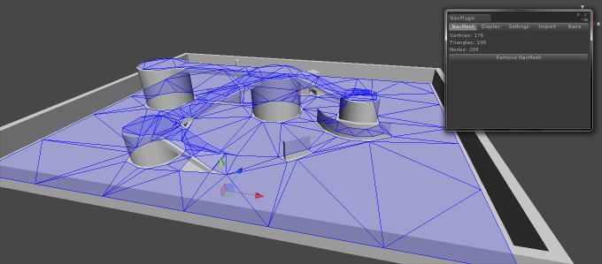

---

## Multiplayer Architecture (Server Authority)

Movement and pathing are computed on the server. Clients receive state updates and smoothly interpolate toward authoritative positions.

  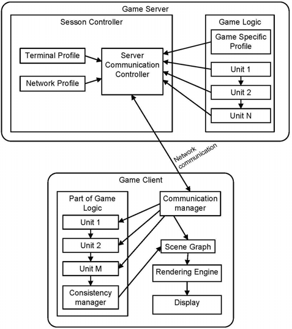

  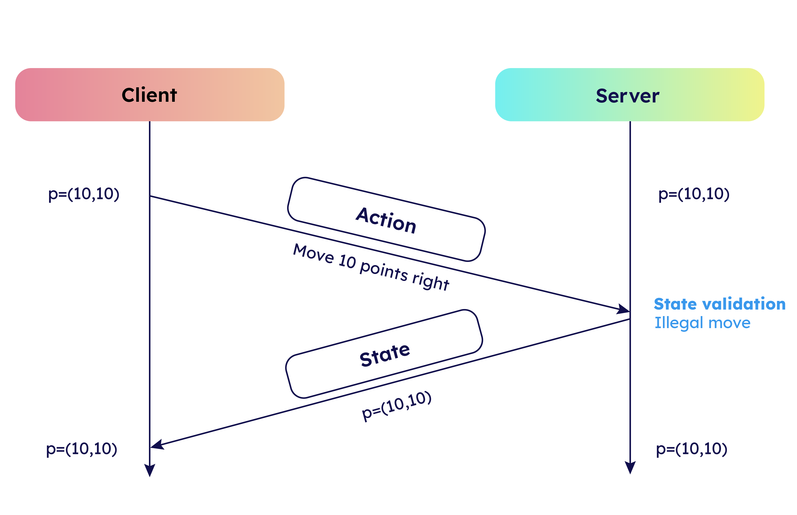

---

## Octree Spatial Partitioning

The world volume is subdivided into hierarchical nodes, enabling efficient spatial queries, obstacle insertion, and volumetric navigation.

  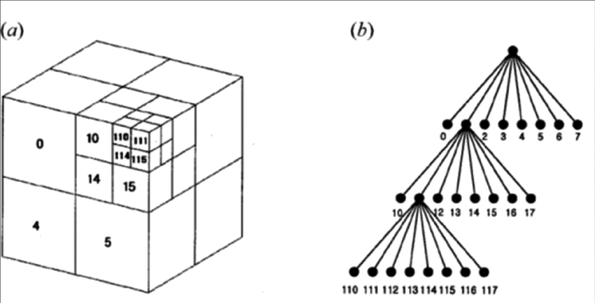

Octree decomposition is used to represent navigable free space and blocked regions at different resolutions.

  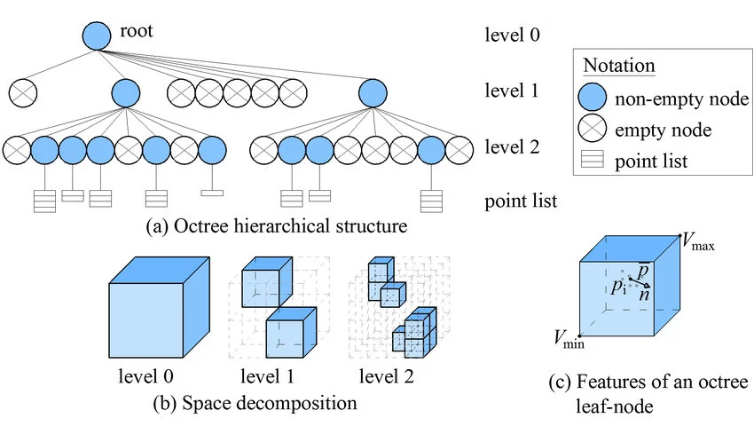

---

## Runtime Octree Debug View

This project includes visualization to inspect subdivision levels and leaf occupancy during development.

  

A reference-style visualization of dense subdivision in complex geometry (useful to communicate the concept clearly in documentation).

  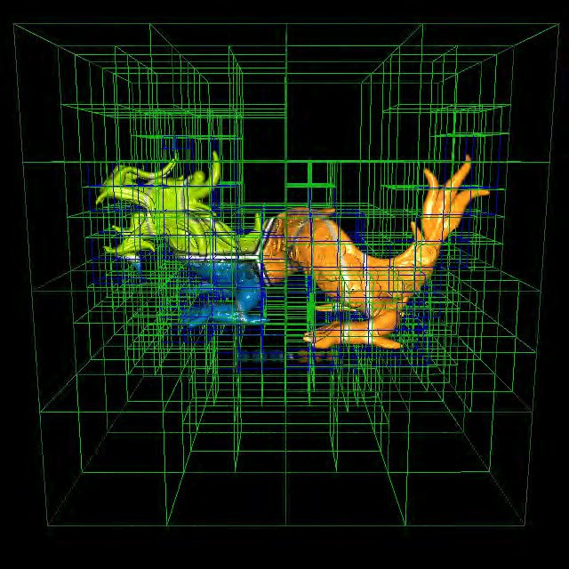

---

## Obstacle Collection and Leaf Validation

Obstacles are collected from physics colliders inside a defined world bounds volume. Leaves can be validated using physics overlap checks for geometry-accurate occupancy.

  

---

## Leaf Graph Extraction (Connectivity)

Empty leaves are collected and converted into a connectivity graph (face neighbors plus additional adjacency linking). This graph becomes the base structure for A*.

  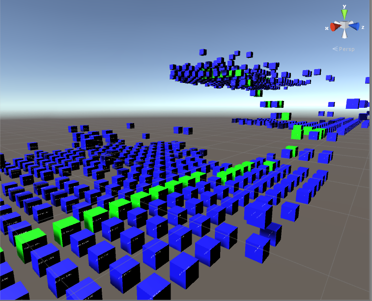

---

## Custom 3D A* Pathfinding

A* runs over the octree leaf graph using a Euclidean 3D heuristic and a custom graph implementation.

  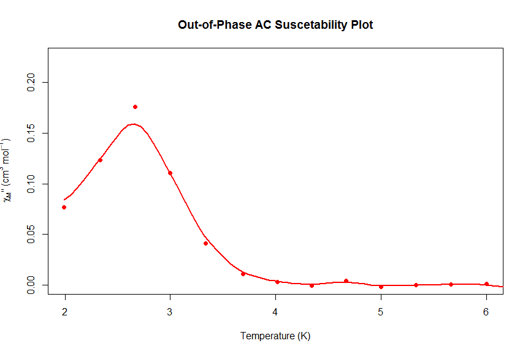

The implementation supports:
1. Euclidean 3D heuristic
2. SortedSet-based open set
3. Search-ID reuse to avoid per-search allocations
4. Iteration safety caps
5. Best-so-far fallback (partial solution when needed)
6. Optional dynamic cost injection (used for traffic avoidance)

---

## Volumetric Path Example (Multi-Level Traversal)

A representative example showing how paths can route through 3D volume across different heights and around obstacles.

  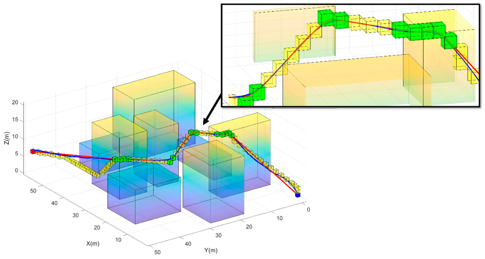

---

## Traffic-Aware Path Diversification

To avoid many agents selecting the same shortest path, the system supports leaf “reservations” that temporarily penalize recently used paths (optionally same-team only).

Result:
1. Less clustering
2. Better path variety
3. More natural agent distribution

---

## Server-Authoritative Physics Movement

Agents move using Rigidbody motion on the server. Clients receive pose updates and render smooth motion via interpolation.

The approach prioritizes:
1. Correctness (authority)
2. Stability (no tunneling through obstacles)
3. Visual smoothness (client interpolation)

---

## Network Smoothing and Interpolation

Clients interpolate toward the most recent authoritative server state to reduce jitter and teleport artifacts.

  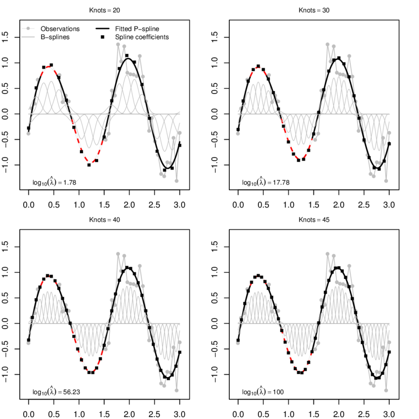

---

## Behavior Tree AI

AI decision-making is implemented using a behavior tree structure.

  

An example editor-style view of a selector/sequence layout (used to communicate the structure clearly).

  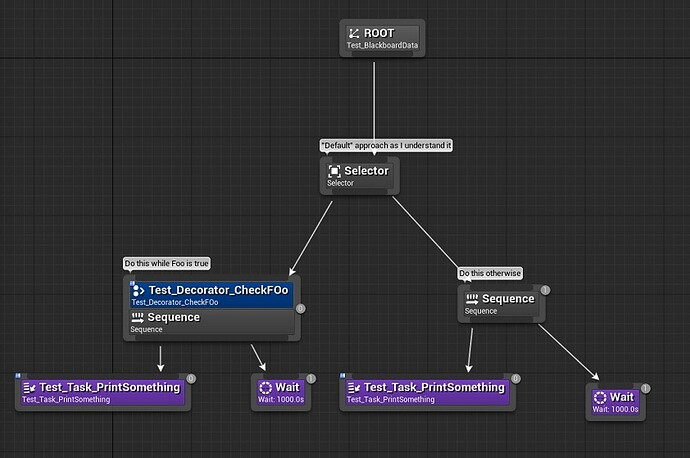

---

## Blackboard Pattern

Behavior tree nodes share state through a blackboard pattern. This keeps the AI modular and reduces coupling between systems.

  

A reference-style architecture diagram showing the blackboard concept at a higher level.

  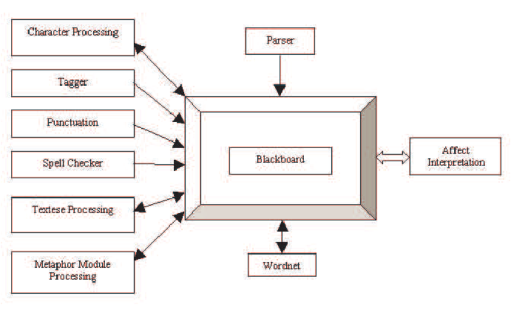

---

## Physics-Based Movement Safety

Each movement step can be validated against obstacle colliders using:
1. SphereCast sweep checks
2. Overlap collision checks
3. Self-collider filtering
4. Clearance padding
5. Fast repath when blocked

This keeps movement physically valid in dynamic environments and multiplayer conditions.

---

## Execution Pipeline

1. Collect obstacle colliders (inside world bounds)
2. Build octree (adaptive or full subdivision)
3. Validate leaves (optional geometry-accurate checks)
4. Collect navigable leaves
5. Build graph connectivity (face + adjacency hash)
6. Run A* (optionally with traffic penalties)
7. Convert leaf path to world waypoints
8. Move using server-authoritative Rigidbody steps
9. Replicate pose to clients and interpolate on observers
10. Drive AI decisions via behavior tree + blackboard

---

## Code Areas Covered (high level)

- Octree generation, occupancy checks, and graph building
- Custom A* graph search and waypoint output
- Agent movement with safety checks and fast repathing
- Server-authoritative replication + client smoothing
- Behavior tree AI nodes and event-driven transitions
- Capture zone controller + manager sync
- Map generation + AI spawning state flow
- Steam lobby / UDP connection bootstrapping

---

## Technologies Used

1. Unity (C#)
2. Rigidbody Physics
3. Custom Octree Implementation
4. Custom A* Pathfinding
5. Multiplayer Networking (server authoritative)
6. Behavior Trees
7. Blackboard Architecture

## Image Credits / Bibliography

Some images in this README are used for conceptual illustration and were sourced online. All rights belong to their respective owners. Where available, the original page is linked below.

1. `Documents/Images/Spatial-partitioning-of-the-octree-structure-Left-A-voxelized-version-of-the-Stanford.png`  
   Source: https://www.researchgate.net/figure/Spatial-partitioning-of-the-octree-structure-Left-A-voxelized-version-of-the-Stanford_fig61_268023043

2. `Documents/Images/Figure-Octree-structure-image-a-shows-the-subdivision-in-cubes-image-b-the-tree.png`  
   Source: https://www.researchgate.net/figure/Figure-Octree-structure-image-a-shows-the-subdivision-in-cubes-image-b-the-tree_fig3_267995345

3. `Documents/Images/Example-of-octree-decomposition.png`  
   Source: https://www.researchgate.net/figure/Example-of-octree-decomposition_fig4_274645446

4. `Documents/Images/octree_example_screen_mini.png`  
   Source: https://castle-engine.io/vrml_engine_doc/output/xsl/html/section.how_octree_works.html

5. `Documents/Images/aerospace-12-00085-g014.png`  
   Source: https://www.mdpi.com/2226-4310/12/2/85

6. `Documents/Images/fig1-1.png`  
   Source: https://math.hws.edu/eck/metric-spaces/open-and-closed-sets.html

7. `Documents/Images/7F0CZ.png`  
   Source: https://gamedev.stackexchange.com/questions/93145/a-pathfinding-in-3d

8. `Documents/Images/qapH8.png`  
   Source: https://stackoverflow.com/questions/37298294/reduce-number-of-nodes-in-3d-a-pathfinding-using-part-of-a-uniform-grid-repre

9. `Documents/Images/server-authoritative-f91558362b208ca10eae39e25dd9698d.png`  
   Source: https://docs.elympics.ai/gameplay/glossary/server-authoritative/index.html

10. `Documents/Images/Hybrid-architecture-for-client-server-mobile-multiplayer-games.png`  
    Source: https://www.researchgate.net/figure/Hybrid-architecture-for-client-server-mobile-multiplayer-games_fig1_234797288

11. `Documents/Images/gPeMi.png`  
    Source: https://stackoverflow.com/questions/39802415/smooth-interpolation-of-my-data

12. `Documents/Images/Smoothing-and-interpolation-with-P-splines-solid-black-lines-for-different-numbers-of.png`  
    Source: https://www.researchgate.net/figure/Smoothing-and-interpolation-with-P-splines-solid-black-lines-for-different-numbers-of_fig1_281487325

13. `Documents/Images/selector1.png`  
    Source: https://www.gamedeveloper.com/programming/behavior-trees-for-ai-how-they-work

14. `Documents/Images/19ee3f120a6df87879aabb765080f8ed8c5a370d_2_690x458.png`  
    Source: https://forums.unrealengine.com/t/how-to-achieve-active-selector-node-functionality-in-ue4-behavior-trees/11585

15. `Documents/Images/blackboard-pattern-components.png`  
    Source: https://dzone.com/articles/the-blackboard-pattern-for-autonomous-navigation

16. `Documents/Images/Blackboard-architecture.png`  
    Source: https://www.researchgate.net/figure/Blackboard-architecture_fig2_220955182

    These images are used for documentation/educational context only; they are not part of the project’s original assets.
